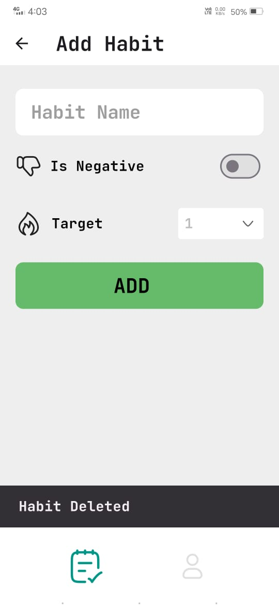
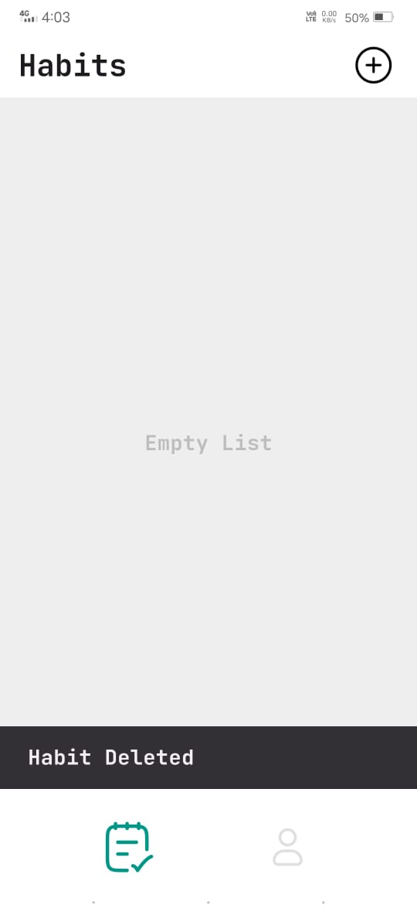
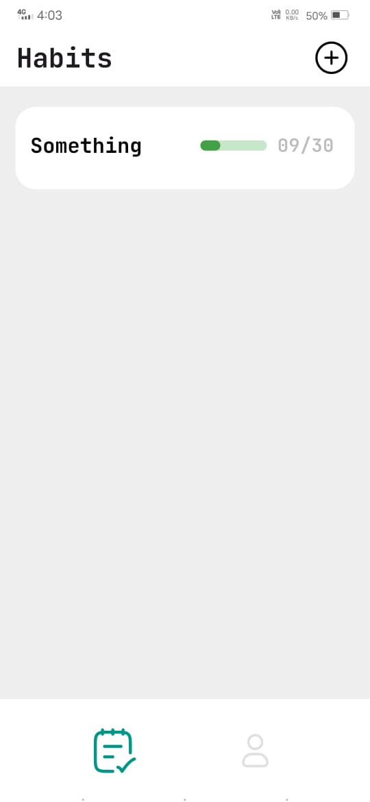
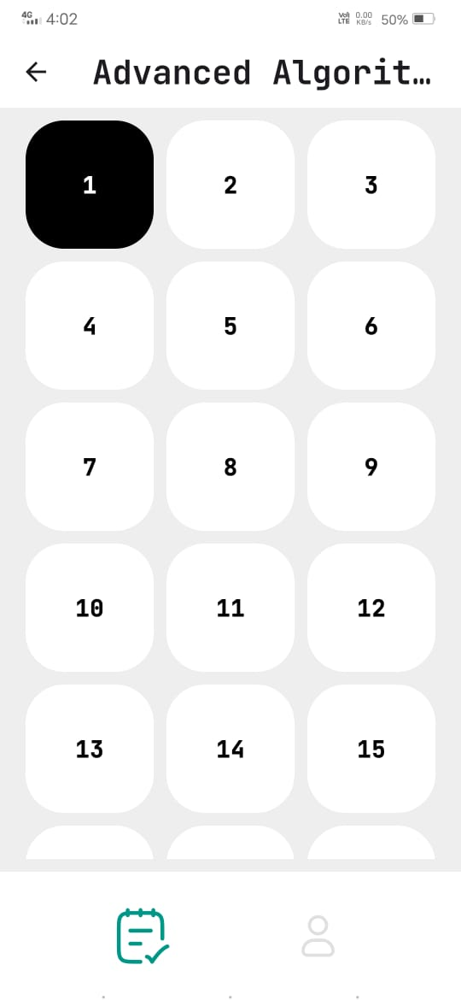
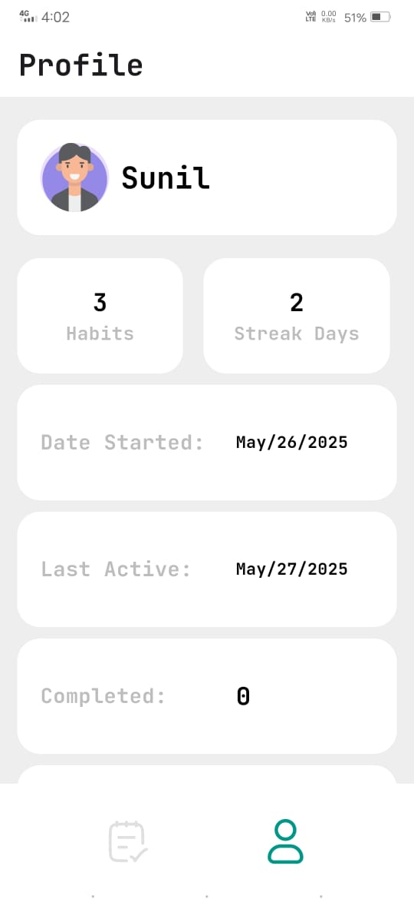

# 📱 90 Days Habit Tracker

Build better habits in 90 days!  
This Flutter app helps you stay consistent with your daily goals using a clean and focused UI, streak tracking, and a well-structured architecture. Designed with scalability and maintainability in mind.

---

## ✨ Features

- ✅ **Daily Task Tracking** – mark tasks as completed or not completed
- 🔥 **Streak System** – stay motivated by maintaining habit streaks
- 👤 **User Profile** – see your progress and stats
- 📊 **Completed & Pending Tasks View**
- 🔒 **Offline-First Experience**
- 🧱 **Built with Clean Architecture** – for better separation of concerns and testability

---

## 🖼️ Screenshots

<!-- Replace these image URLs or file paths with your actual screenshots -->

  
  
  

  
  
  

---

## 📥 Download

[**⬇️ Download APK**](https://github.com/Sunil-Andrade/90_days/releases/download/v1.0.0/app-release.apk)

---

## ⚙️ Tech Stack

- **Flutter**
- **Dart**
- **Clean Architecture (Presentation, Domain, Data layers)**
- **Bloc** 
- **Local Storage Hive**

---

## 🚀 Future Improvements

- ☁️ Cloud sync & backup  
- 🎨 Custom habit categories & color tags  
- 📱 Home screen widgets  
- 📆 Calendar-based habit view  

---

Thanks for checking out the app! I want you to know that I appreciate your feedback.
